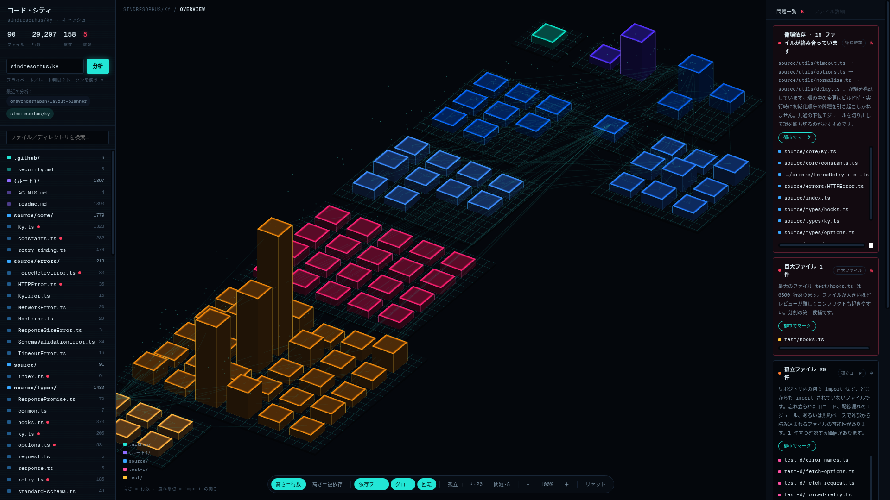

# コード・シティ（Codebase City）

GitHub リポジトリをアイソメトリックな「都市」として可視化し、孤立コード・循環依存・巨大ファイルなどの構造上の問題を自動検出するツールです。



> 上図は実際に `sindresorhus/ky`（90 ファイル / 29,207 行）を解析した結果。
> 右の問題一覧には **16 ファイルが絡み合う循環依存**（実際に存在します）と 6,560 行の巨大テストファイルが検出されています。

## できること

- **リポジトリを丸ごと都市化** — ディレクトリは街区、ファイルはビル、高さは行数（または被依存数）。import はビルの間を這い回る光の点として流れます。
- **孤立コードのハイライト** — 何も import せず、どこからも import されていないファイルをアラートレッドで発光させます。
- **問題の自動検出**（深刻度：高／中／低）
  - 循環依存（Tarjan の強連結成分分解）
  - デッドコード疑惑（依存はあるが誰からも参照されない）
  - 巨大ファイル／ハブファイル／高結合ファイル
- **多言語の依存解析** — JS/TS（ESM・CJS・動的 import・TS パスエイリアス対応）、Python、Go、Java、Rust、C/C++、Ruby。外部パッケージはノイズになるため描画しません。
- **プライベートリポジトリ対応** — GitHub トークンをその場で入力（保存されません）。分析結果はコミット SHA をキーにキャッシュされ、変更がなければ即座に開きます。
- 900 ファイルを超える大規模リポジトリはディレクトリ単位の「街区ビル」に自動集約。

## 技術構成

| 層 | 技術 |
|---|---|
| フロントエンド | React 19 + TypeScript + Vite |
| 3D | three.js（InstancedMesh + カスタムシェーダー、正交投影の固定アイソメ角） |
| バックエンド | Hono + tRPC（zipball 取得 → import 解析 → 依存グラフ構築） |
| DB | Drizzle ORM + MySQL（分析結果キャッシュ） |

## ローカルで動かす

```bash
npm install
cp .env.example .env   # DATABASE_URL を設定
npm run db:push        # スキーマを DB に反映
npm run dev            # http://localhost:3000
```

```bash
npm run build          # 本番ビルド（dist/）
npm start              # 本番サーバー起動
```

## 使い方

1. 左カラムに `owner/repo` または GitHub URL を入力 → 「分析」
2. 都市をドラッグで回転、ホイールでズーム、ビルをクリックで詳細表示
3. 「孤立コード」ボタンで孤立ファイルを強調、「問題」ボタンで深刻度別にマーク
4. プライベートリポジトリは「トークンを使う」から PAT を入力

### サンプルデモ

アプリを開いた時点で、40 ファイルの**サンプルリポジトリ**の都市が自動で表示されます（ネットワーク不要）。ツールバーの「孤立コード」「問題」ボタンを押せば、サンプルに仕込まれた孤立ファイル・巨大ファイル・ハブファイルのハイライトをその場で試せます。

実際のリポジトリで試すなら `sindresorhus/ky` や `psf/requests` がおすすめです —— どちらも公開リポジトリで、循環依存・孤立ファイル・巨大ファイルが実際に検出されます。

---

*Built with Kimi · ホログラフィックな都市の中で、コードの構造が見える。*
